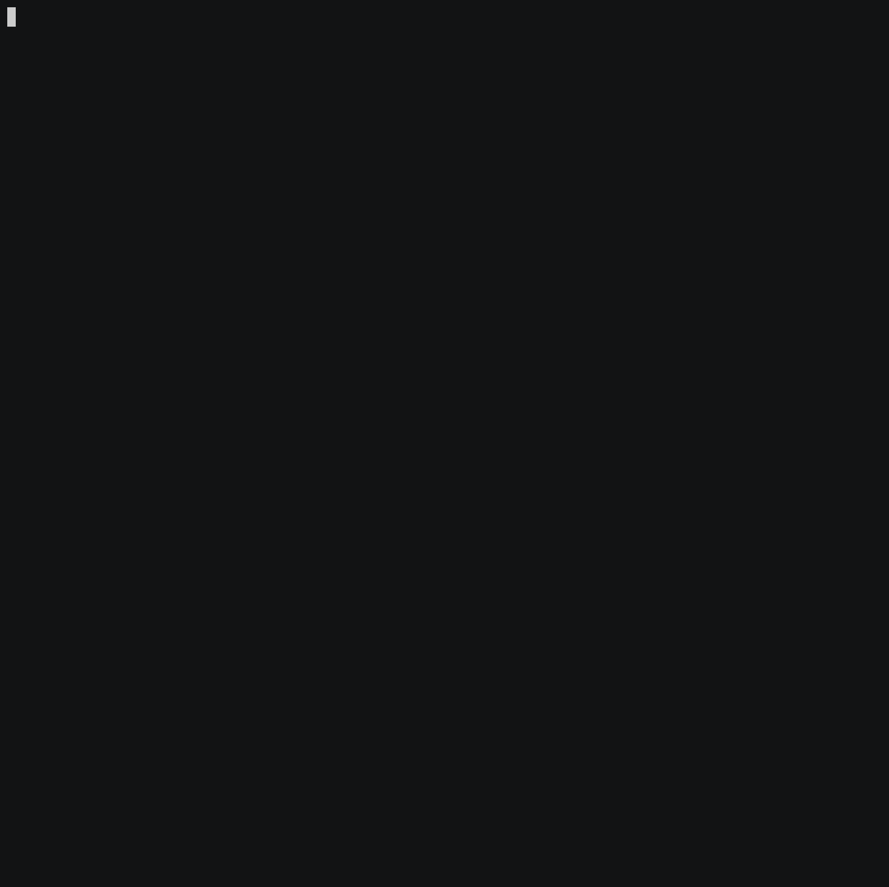

# Вычислитель отличий

[](https://github.com/aminin/frontend-project-lvl2)
[](https://codeclimate.com/github/aminin/frontend-project-lvl2/maintainability)
[](https://codeclimate.com/github/aminin/frontend-project-lvl2/test_coverage)
[](https://github.com/aminin/frontend-project-lvl2)

Утилита командной строки для вычисления отличий между файлами `json` и `yaml` (`yml`).

## Системные требования

 - Bash / Zsh
 - Make
 - Git
 - Node 14+

## Установка

Для установки выполните следующие команды:

```bash
git clone git@github.com:aminin/frontend-project-lvl2.git
cd frontend-project-lvl2
make
npm link
```

## Примеры использования

### Сравнение плоских файлов json

[](https://asciinema.org/a/HiRn3dYbIbdp08fIDa8qm8pJR)

### Сравнение плоских файлов yaml

[](https://asciinema.org/a/rUvibmEZA8GKFx4MA8u4UkH7H)

### Рекурсивное сравнение

[](https://asciinema.org/a/3rtAXnDN63TwSpO8kwNZO5cQg)

### Плоский формат

[](https://asciinema.org/a/c47VYfsmuJT7sejg0HQRgg0az)

### JSON формат

[](https://asciinema.org/a/PpkJJRNcT9QOo7kxfJWORUd88)
